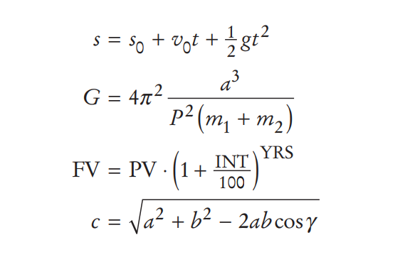
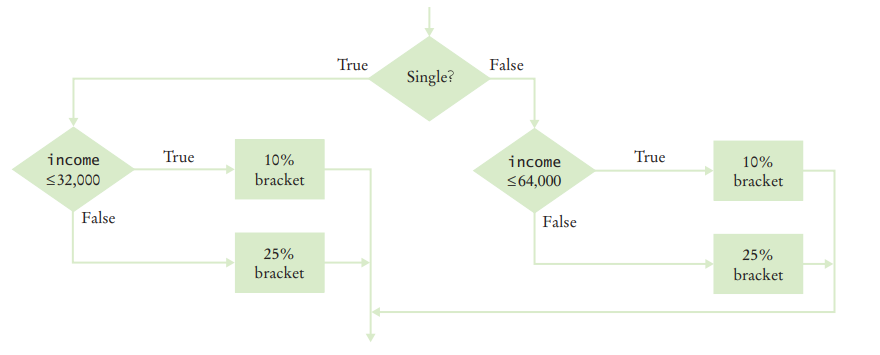
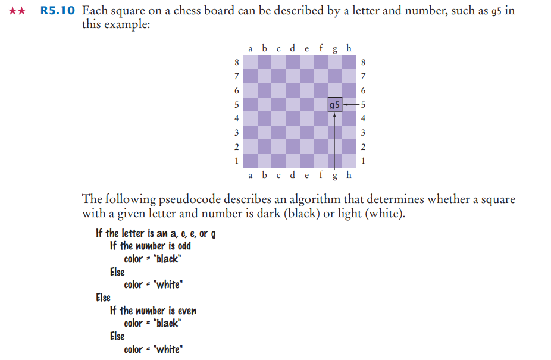

#### 1. What do the following statements print? Don’t guess; write programs to find out.
        
    a. System.out.println("3 + 4");
    b. System.out.println(3 + 4);
    c. System.out.println(3 + "4");

---
####  2. Write an java program that should print Hello world in quotes Output: "Hello World"

####  3. Write a program in java NamePrinter that displays your name inside a box on the console screen, like this:
    +----+
    |Test|
    +----+
   Do your best to approximate lines with characters, such as |, -, and +.
   
---
#### 4. Write a program that prints an animal speaking a greeting, similar to (but different from) the following

     /\_/\     -----
    ( ‘ ’ )  / Hello \
     ( - ) <   Junior |
     | | |   \ Coder!/
    (__|__)    -----

---
#### 5. Type in and run the following program:
    
    import javax.swing.JOptionPane;

    public class DialogViewer {
        public static void main(String[] args) {
            JOptionPane.showMessageDialog(null, "Hello, World");
            System.exit(0);
        }
    }

##### Then modify the program to show the message “Hello, your name!”.

---
#### 6. Run the following program:

    import java.net.URL;
    import javax.swing.ImageIcon;
    import javax.swing.JOptionPane;
    
    public class Test {
        public static void main(String[] args) throws Exception {
            URL imageLocation = new URL("https://horstmann.com/bigjava/duke.gif");
            JOptionPane.showMessageDialog(null, "Hello", "Title",
                    JOptionPane.PLAIN_MESSAGE, new ImageIcon(imageLocation));
            System.exit(0);
        }
    }
    
##### Then modify it to show a different greeting and image.

---
#### 7. Write below algorithm in java

1. Create a byte variable and set your birth of date's day
2. Create a byte variable and set your birth of date's month
3. Create an int variable and set your birth of date's year
4. Create a byte variable and set current day
5. Create a byte variable and set current month
6. Create an int variable and set current year
7. Calculate how many days is you live in our planet and set the days in a long variable

---
#### 8. Write a java program that converts AZN to USD

#### 9. Write the following mathematical expressions in Java

#### 10. Write an TaxCalculator 
* Follow this algorithm

Output: 
Tax: 10400.0

Answer:
* [TaxCalculator.java](../../java-bootcamp/src/main/java/week01/TaxCalculator.java)

---

#### 11. What is the value of each variable after the if statement?
    a. int n = 1; int k = 2; int r = n; if (k < n) r = k;
    b. int n = 1; int k = 2; int r; if (n < k) r = k; else r = k + n;
    c. int n = 1; int k = 2; int r = k; if (r < k) n = r; else k = n;
    d. int n = 1; int k = 2; int r = 3; if (r < n + k) r = 2 * n; else k = 2 * r;

#### 12.

#### 13. [Hackerrank Java If-Else](https://www.hackerrank.com/challenges/java-if-else/problem?isFullScreen=true)
#### 14. [Hackerrank Java Datatypes](https://www.hackerrank.com/challenges/java-datatypes/problem?isFullScreen=true)
#### 15. [First 4 task](https://www.w3resource.com/java-exercises/basic/index.php)

