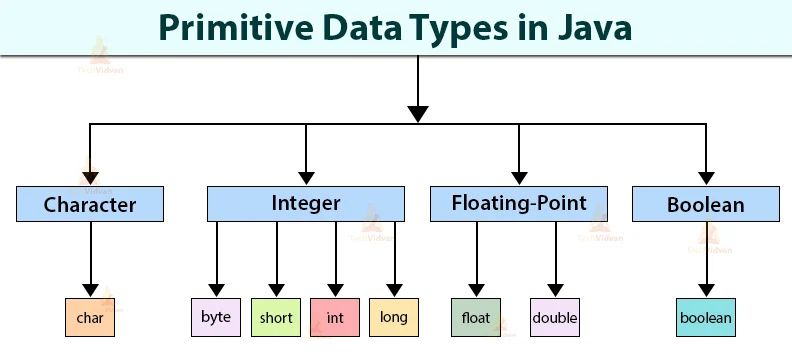

## 0️⃣1️⃣ Download and Install IntelliJ
[IntelliJ Download](https://www.jetbrains.com/idea/download/#section=windows)

---
## 0️⃣2️⃣ Download JDK 8
* Download from intelliJ

---
## 0️⃣3️⃣ Explain Main method and Write first program (Hello World)
* [HelloWorld.java](../../src/main/java/com/mastercode/week01/Main.java)

---
## 0️⃣4️⃣ Keywords və Dəyişənlər (Data)
* [Keywords Doc](https://docs.oracle.com/javase/specs/jls/se19/html/jls-3.html#jls-3.9)

* [Variables.java](../../src/main/java/com/mastercode/week01/PrimitiveDataTypes.java)

---
0️⃣5️⃣ Data Tiplər

* [PrimitiveDataTypes.java](../../src/main/java/com/mastercode/week01/PrimitiveDataTypes.java)

---
0️⃣6️⃣ Type Casting
* [TypeCasting.java](../../src/main/java/com/mastercode/week01/TypeCasting.java)

---
0️⃣7️⃣ Ədədlər üzərində əməllər
* [Operators.java](../../src/main/java/com/mastercode/week01/Operators.java)

---
0️⃣8️⃣ İf...Else şərtləri
* [IfElseStatement.java](../../src/main/java/com/mastercode/week01/IfElseStatement.java)

0️⃣9️⃣ Method
* [Methods](../../src/main/java/com/mastercode/week01/method)

---
### Resources

#### Məqalələr
* [Primitive Data Types W3School](https://www.w3schools.com/java/java_data_types.asp)
* [Primitive Data Types Baeldung](https://www.baeldung.com/java-primitives)
* [Primitive Data Types Oracle Doc](https://docs.oracle.com/javase/tutorial/java/nutsandbolts/datatypes.html)
* [Java If-else Statement](https://www.javatpoint.com/java-if-else)
* [Java Methods](https://www.w3schools.com/java/java_methods.asp)
* [Java Methods](https://www.geeksforgeeks.org/methods-in-java/)
* [Java Methods](https://www.programiz.com/java-programming/methods)

#### Videolar
* [Java Tutorial | Primitive Data Type in Java](https://www.youtube.com/watch?v=wocR5kkgtvU)
* [Primitives Data Types In Java - All the Primitives And What They Do](https://www.youtube.com/watch?v=WQ7mvQFSmYc)
* [Type Conversion in Java](https://www.youtube.com/watch?v=CPk8pffKV64)
* [Java Tutorial | If Else | Selection Statemen](https://www.youtube.com/watch?v=rn9h0TSftyw)
* [Nested if-else Statements in Java](https://www.youtube.com/watch?v=6sYZDA8JPhk)
* [Methods in Java Tutorial](https://www.youtube.com/watch?v=cCgOESMQe44)
* 