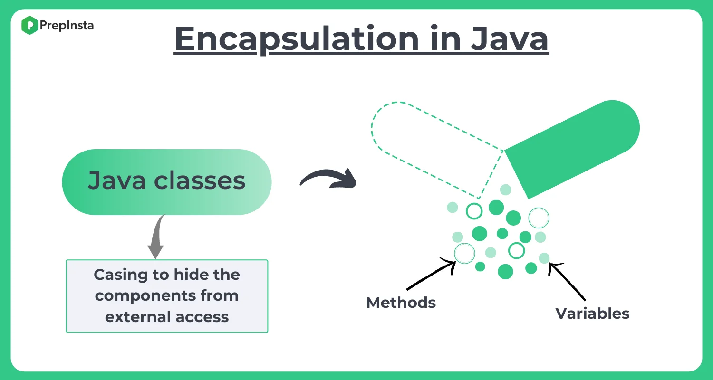

## 0️⃣1️⃣ Object and Class

* fields, attributes

    `[access_modifier] [static] [final] type name [= initial value] ;`

* create class in one class
* create class in different class
* stack and heap
* declare class but not create and call the fields (null.smt)
* static
  * fields
  * methods
  * declare class and call the static fields and methods
  * when create static method (does it use any instance variable or instance methods? if no create static method)
* methods (əmr)
* this keyword
* constructors
  * new keyword
  * default constructor
    * write own default
    * test it with print
  * multiple constructor 
  * no-arg constructor
  * calling a constructor from a constructor this()
  * task 
    * find area of rectangle

---
## 0️⃣2️⃣ Guess Game

---
## 0️⃣3️⃣ Encapsulation

* access modifiers
* package problem and solution
* problem (-, null)
* solution
* "sensitive" data is hidden from users
* private
* getter
* setter

---
### Resources

#### Məqalələr
* [Objects and Classes in Java](https://www.javatpoint.com/object-and-class-in-java)
* [What is Class and Object in Java OOPS? Learn with Example](https://www.guru99.com/java-oops-class-objects.html)
* [Java Constructors](https://www.programiz.com/java-programming/constructors)
* [A Guide to the Static Keyword in Java](https://www.baeldung.com/java-static)
* [Providing Constructors for Your Classes](https://docs.oracle.com/javase/tutorial/java/javaOO/constructors.html)
* [Using the this Keyword](https://docs.oracle.com/javase/tutorial/java/javaOO/thiskey.html)
* [Encapsulation In JAVA](https://medium.com/@imtiazahmedburiro/encapsulation-in-java-16a38772e9af)
* [What is Encapsulation in Java and How to Implement It](https://www.simplilearn.com/tutorials/java-tutorial/java-encapsulation)
* [Encapsulation in Java](https://www.geeksforgeeks.org/encapsulation-in-java/)
* [Access Modifiers in Java](https://www.javatpoint.com/access-modifiers)

#### Videolar
* [Java Classes & Objects](https://www.youtube.com/watch?v=IUqKuGNasdM)
* [Introduction to Classes and Objects ](https://www.youtube.com/watch?v=8yjkWGRlUmY&t=319s)
* [Java Constructors - Full Tutorial](https://www.youtube.com/watch?v=pgBk8HC7jbU)
* [This Keyword in Java Full Tutorial - How to Use "this"](https://www.youtube.com/watch?v=ETLHbHenW44)
