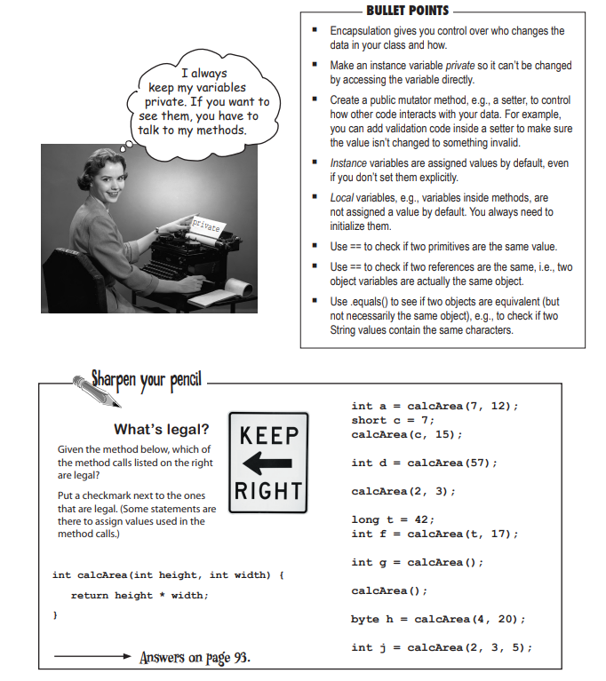
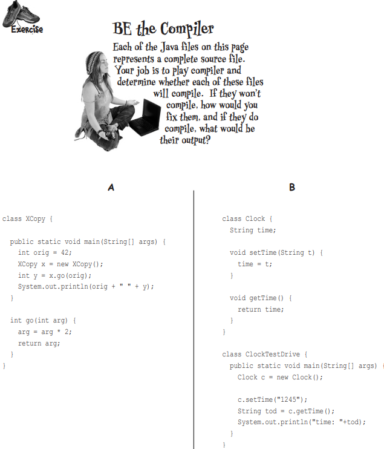
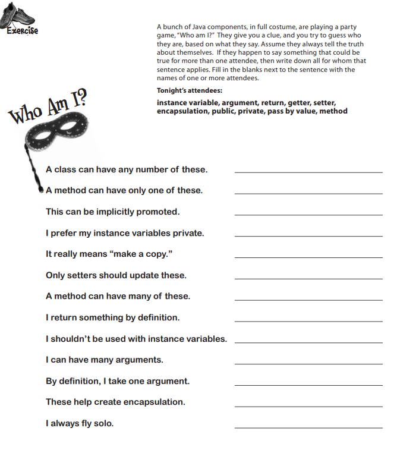
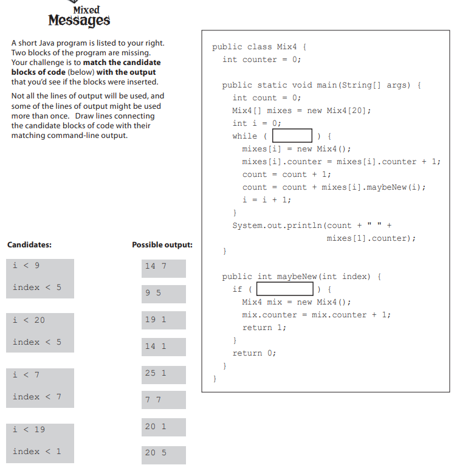
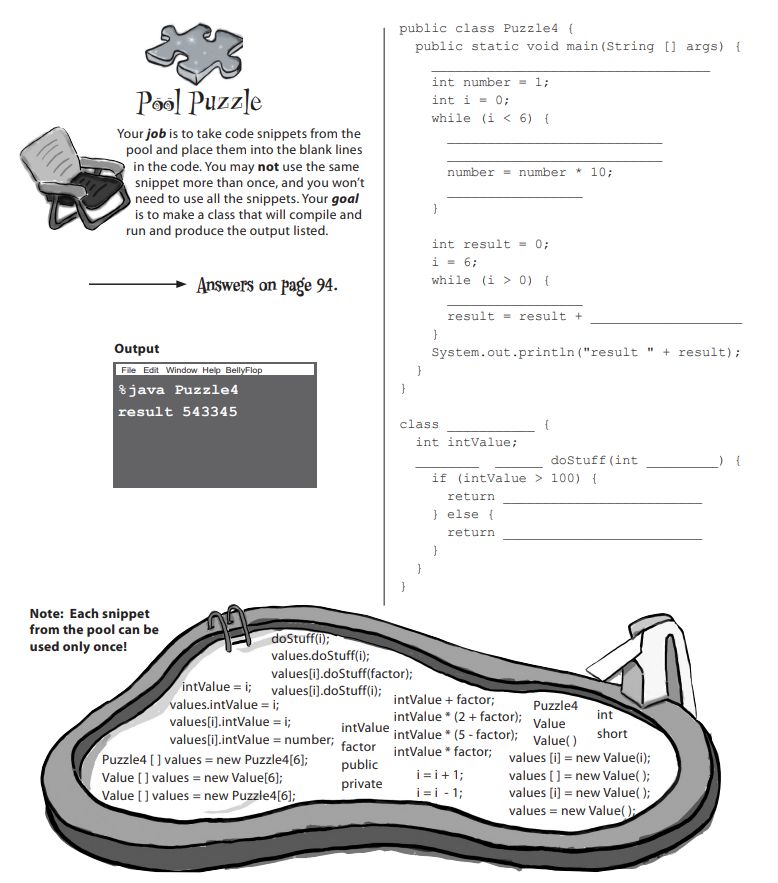

## Task 1.
Your task is to create the Worker class, the Employee class, and either the SalariedEmployee, or the HourlyEmployee class.
For each class, create the attributes and methods shown on this diagram.
Create a main method that will create either a SalariedEmployee or HourlyEmployee, and call the methods, getAge, collectPay, and the method shown for the specific type of class you decide to implement.

## Task 2

## Task 3

## Task 4

## Task 5

## Task 6
