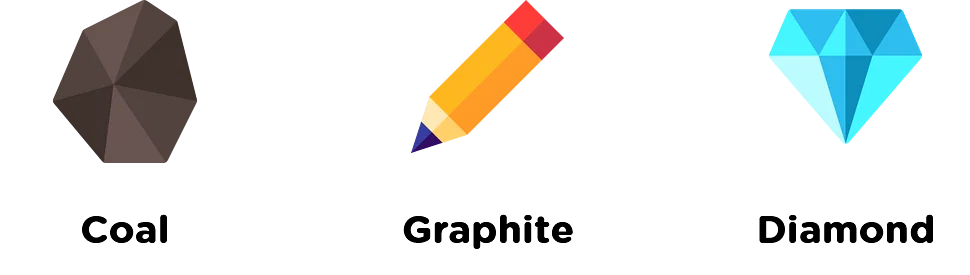

## 0️⃣1️⃣ Inheritance

---
## 0️⃣2️⃣ Guess Game

* problem create classes separately
* slide
* solution
* a class can only extends one class
* implement all arguments
* super, super(), this, this()
  * Shape x,y
    * Rectangle width, height and play around it (bad practice and best practice)
* java Object class
* type of inheritance
  

* Challenge
  

---
## 0️⃣3️⃣ Polymorphism

* Example animal -> cat, dog, cow -> make sounds

Type of polymorphism

* Compile time polymorphism -> overloading
  * The compiler determines which method to call based on the type and number of arguments passed to the method.
* Runtime polymorphism -> overriding
  * When a method is called on an object, the runtime system determines which implementation of the method to use based on the actual type of the object, not just its declared type.

---
### Resources

#### Məqalələr
* [Inheritance](https://www.digitalocean.com/community/tutorials/inheritance-java-example)
* [Polymorphism](https://medium.com/lets-do-it-pl/what-is-polymorphism-and-what-are-the-advantages-of-it-8947a79125e8)
* [Polymorphism](https://docs.oracle.com/javase/tutorial/java/IandI/polymorphism.html)

#### Videolar
* [How Do We Get User Input in Java?](https://www.youtube.com/watch?v=bI7kQq9cjmQ)
* [Switch Statement in Java](https://www.youtube.com/watch?v=IrQKDdptiw8)
* [Loops in Java](https://www.youtube.com/watch?v=hs45eeZ326U&ab_channel=Simplilearn)
* [Pattern ilə bağlı alqoritmik məsələlərin həlli](https://www.youtube.com/watch?v=lsOOs5J8ycw&t=2164s&ab_channel=KunalKushwaha)