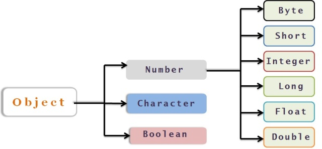
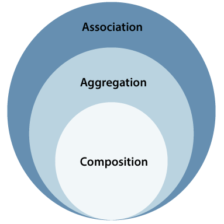
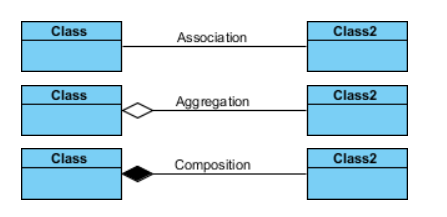

## 0️⃣0️⃣ JOKE

## 0️⃣1️⃣ Types of Classes in Java

### Concrete class
These are the most common type of classes in Java, which can be instantiated to create objects. Concrete classes can have abstract methods, but they must provide an implementation for all their abstract methods.

### Final class

These are classes that cannot be extended by any other class. Final classes are often used to prevent inheritance and ensure that a class behaves as expected.

### Inner class
These are classes defined inside another class. Inner classes can be static or non-static, and they can access the instance variables and methods of their enclosing class.

### Nested class
These are classes defined inside another class, including inner classes and static nested classes. Nested classes can access private members of their enclosing class, and they are often used to encapsulate related functionality in a single place.

### Abstract class

These are classes that cannot be instantiated directly, but they can be extended to create new classes. Abstract classes can have both abstract and non-abstract methods, and they are often used to define a common behavior for a group of related classes.

### Interface
These are a special type of class that defines a set of abstract methods that a class implementing that interface must implement. Interfaces are often used to define a contract that other classes must follow.

### Anonymous class
These are classes without a name, which are defined inline as part of a method or constructor. Anonymous classes are often used to implement interfaces or extend classes on-the-fly

### Wrapper Class
A wrapper class is a class that provides an object representation of a primitive data type. The eight primitive data types in Java are boolean, byte, char, short, int, long, float, and double. For each of these primitive data types, there is a corresponding wrapper class:

---
## 0️⃣2️⃣ UML

Association, composition, and aggregation are all types of relationships between classes in object-oriented programming

* Association (Has a)

  Association, in general terms, refers to the relationship between any two entities. Association in java is the relationship that can be established between any two classes. 
  
  These relationships can be of four types:

  * One-to-One relation (Email -> User Account)
  * One-to-many relation (Country -> City)
  * Many-to-one relation (Order -> Customer)
  * Many-to-many relation (Book -> Author)

* Aggregation 
  * has a
  * weak association
  Aggregation represents a weak relationship between two classes where one class (the whole) contains a reference to the other class (the part), but the part can exist independently of the whole.
  
  Example: Department and Employee

* Composition 
  * part-of
  * strong association 
  * child does not exist independently of its parent
 Composition represents a strong relationship between two classes where one class (the composite) contains the other class (the component). The component cannot exist independently of the composite, and any changes to the composite will affect the component.

  Example: Folder and File

# 0️⃣3️⃣ Abstraction
* Abstract class
* Interface

# 0️⃣4️⃣ Enum
An enum is a special "class" that represents a group of constants (unchangeable variables, like final variables).

# 0️⃣6️⃣ Demo Proyekt

---
### Resources

#### Məqalələr

#### Videolar
